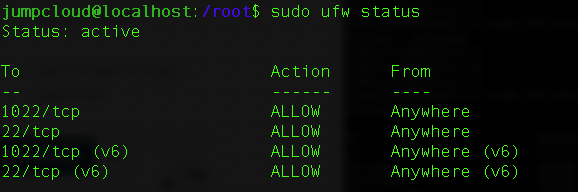

# Updating from Ubuntu 20.04 (Focal), to 24.04 (Noble)

Based off this [link](https://jumpcloud.com/blog/how-to-upgrade-ubuntu-22-04-to-ubuntu-24-04#:~:text=It%20is%20worth%20noting%20that,of%20Ubuntu%20before%20you%20upgrade.)
you are not able to directly upgrade from 20.04 to 24.04. So you need to do 2 separate upgrades

## Upgrading from 20.04 to 22.04

Based on this video: https://www.youtube.com/watch?v=rTzYk7d-pzo

```shell
# Check you're on a supported OS - Should say VERSION="20.04.6 LTS (Focal Fossa)"
$ cat /etc/os-release
# Check all packages are up to date
$ sudo apt-get update && apt-get upgrade -y
# Check for a found upgrade (Should find a jammy.tar.gz file)
$ sudo do-release-upgrade
```

It will then do a few auto-update prompts before giving you a large prompt for the final full update. It should
be several hundred MB or possibly close to 1GB in size. It will mention hundreds of packages being updated / removed
e.t.c. Continue with `y` - NB: Some of the large packages will be linux firmware ones

Once this has all been done they will then be unpacked. At which point you should get a prompt on your machine to
configure some high level libraries like libc6 and libssl. This will ask for permission to auto-restart services without
needing a prompt so the install can continue. Simply select yes (This is similar to doing a `-y` flag on apt commands)

You may get 1/2 other prompts about needing to kill ssh processes or suchlike. For each of these keeping the existing
version and continuing should be enough (You can always update them later)

After a few minutes it should then finish and prompt for a reboot. This is a good time to do a first reboot to test
that the initial steps have worked

```shell
# Check you're on a supported OS - Should say VERSION="22.04.3 LTS (Jammy Jellyfish)"
$ cat /etc/os-release
# Check all packages are up to date
$ sudo apt-get update && sudo apt-get upgrade -y
```

## Upgrading from 22.04 to 24.04

Based on these articles: 
- https://jumpcloud.com/blog/how-to-upgrade-ubuntu-22-04-to-ubuntu-24-04#:~:text=It%20is%20worth%20noting%20that,of%20Ubuntu%20before%20you%20upgrade.
- https://linuxconfig.org/ubuntu-upgrade-to-24-04-noble-numbat-a-step-by-step-howto-guide

NB: Currently some of the tasks required need to be done manually and aren't included in the auto-update package
(This may change in time)

```shell
# Grab all upgradable packages beforehand
$ sudo apt list --upgradable
# Check all packages are up to date
$ sudo apt-get update && sudo apt-get upgrade -y
# Manually set up a TCP port (required to be done manually)
$ sudo ufw allow 1022/tcp
$ sudo ufw enable
$ sudo ufw reload
$ sudo ufw status
# Check the image below to see if it's upgraded correctly
```



```shell
# Install the update manager packages
$ sudo apt-get install ubuntu-release-upgrader-core update-manager-core
# Run the update command
$ sudo do-release-upgrade -d
```

It will then do a few auto-update prompts before giving you a prompt for a daemon socket on TCP port 1022.
Say `y` to this. It will then give you a large prompt for the final full update

It should be several hundred MB or possibly close to 1GB in size. It will mention hundreds of packages being
updated / removed e.t.c. Continue with `y` - NB: Some of the large packages will be linux firmware ones

You may get 1/2 other prompts about needing to keep the existing version and continuing - do this

If prompted to reboot afterwards do so

```shell
# Post update lets check the version - should say 24.04 noble
$ lsb_release -a
# Then delete the TCP updates we did to permit the upgrade
$ sudo ufw delete allow 1022/tcp
# Check these next 2 commands out
$ ls -l etc/apt/sources.list.d/
$ sudo apt autoremove --purge
```
